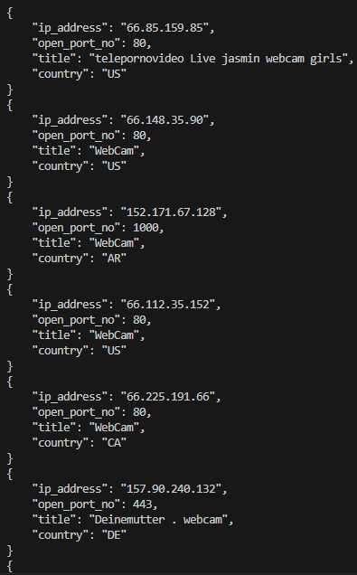

# Webcam 📹 

## Overview
***criminalip_webcam.py*** is a python program that retrieves *webcam* related assets(e.g. IP, Port, Title, Country) using criminal ip banner search api

## Prerequisites
Go to [criminalip.io](criminalip.io), sign up and get Criminal IP API Key
API Key itself is free and if you have account they automatically assign you one.

## Installation and Setup / Usage
Insert the api key number from criminal ip to the ```x-api-key``` variable in the ```criminalip_webcam.py``` file

> [!TIP]
> If you have additional criminal ip search queries that you want to use, you can manually add them by putting them to the ```QUERY_LIST```

## How to get started
Execute the file ```criminalip_webcam.py```

## Screenshot


<details open>
  <summary><i>Extra Tips</i></summary>
  By default, the offset value of base_url is limited to max of "100".
  If you want more IP and Port information, you can reset the limit value. </details>

----

Hope you enjoy!

If you are interested in fetching other type of assets like Printer or Docker, check out my other repositories in [criminalIP_find_Application](https://github.com/Whatnotkkachi7/criminalIP_find_Application)